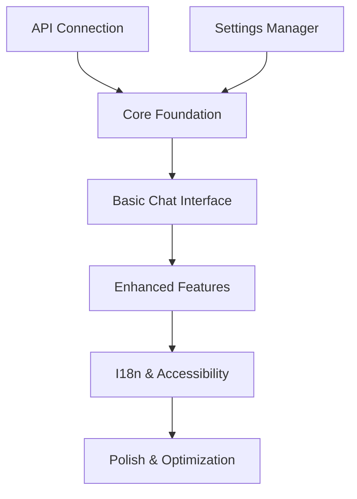

# WP-DialogPro Development Roadmap

## Phase 0: Project Setup and Proof of Concept (1 week)
```markdown setup-phase.md
- Set up development environment
- Create basic plugin structure
- Create GitHub repository
- Implement simple API connection test
- Create basic chat interface prototype

Key Milestone: Working proof of concept that can connect to API and display messages
Dependencies: None
```

## Phase 1: Core Foundation (2 weeks)
```php class-dialogpro-core.php
/* Components to develop:
 * - Core Plugin Bootstrap
 * - Basic Settings Manager
 * - Initial API Handler
 */

class DialogProCore {
    public function __construct() {
        $this->define_constants();
        $this->load_dependencies();
    }
    
    private function define_constants() {
        define('DIALOGPRO_VERSION', '0.1.0');
        define('DIALOGPRO_PATH', plugin_dir_path(__FILE__));
    }
}
```

Tasks:
1. Core plugin structure (3 days)
2. Basic settings page (3 days)
3. Initial API connection handler (4 days)
4. Unit test setup (2 days)

Milestone: Plugin activates, stores settings, connects to API
Dependencies: None

## Phase 2: Basic Chat Interface (3 weeks)
```php class-dialogpro-interface.php
/* Components to develop:
 * - Chat Interface Manager
 * - Basic Session Manager
 * - Simple Message Handler
 */

class DialogProInterface {
    public function init() {
        add_action('wp_enqueue_scripts', [$this, 'enqueue_assets']);
        add_action('wp_footer', [$this, 'render_chat_window']);
    }
}
```

Tasks:
1. Basic chat window UI (1 week)
2. Session management (4 days)
3. Message handling system (4 days)
4. Basic error handling (3 days)

Milestone: Working chat interface with basic functionality
Dependencies: Core Foundation

## Phase 3: Enhanced Features (3 weeks)
```php class-dialogpro-messages.php
/* Components to develop:
 * - Advanced Message Handler
 * - Style Manager
 * - Token Management
 */

class DialogProMessages {
    private $token_limit = 8500;
    
    public function process_message($message) {
        if ($this->check_token_limit()) {
            return $this->send_to_api($message);
        }
        return new WP_Error('token_limit_exceeded');
    }
}
```

Tasks:
1. Token tracking system (4 days)
2. Style customization options (1 week)
3. Enhanced error handling (3 days)
4. Advanced message formatting (4 days)

Milestone: Full featured chat system with token management
Dependencies: Basic Chat Interface

## Phase 4: Internationalization & Accessibility (2 weeks)
```php class-dialogpro-i18n.php
/* Components to develop:
 * - I18n Handler
 * - Accessibility Features
 * - RTL Support
 */

class DialogProI18n {
    public function load_plugin_textdomain() {
        load_plugin_textdomain(
            'wp-dialogpro',
            false,
            dirname(plugin_basename(__FILE__)) . '/languages/'
        );
    }
}
```

Tasks:
1. Translation system setup (3 days)
2. German translation (2 days)
3. WCAG compliance implementation (5 days)
4. RTL support (2 days)

Milestone: Fully accessible, multilingual chat system
Dependencies: Enhanced Features

## Phase 5: Polish & Optimization (2 weeks)
```php class-dialogpro-optimization.php
/* Components to develop:
 * - Cache Manager
 * - Performance Optimizations
 * - Security Enhancements
 */

class DialogProOptimization {
    public function init_caching() {
        // Implementation
    }
    
    public function optimize_assets() {
        // Implementation
    }
}
```

Tasks:
1. Performance optimization (4 days)
2. Security hardening (3 days)
3. Asset optimization (3 days)
4. Final testing and bug fixes (4 days)

Milestone: Production-ready plugin
Dependencies: All previous phases

## Testing & Documentation (Ongoing)
```markdown testing-plan.md
- Unit tests for each component
- Integration tests
- User documentation
- Developer documentation
- API documentation
```

## Timeline Summary (13 weeks total)
1. Phase 0: Project Setup (1 week)
2. Phase 1: Core Foundation (2 weeks)
3. Phase 2: Basic Chat Interface (3 weeks)
4. Phase 3: Enhanced Features (3 weeks)
5. Phase 4: I18n & Accessibility (2 weeks)
6. Phase 5: Polish & Optimization (2 weeks)

## Key Development Checkpoints
```markdown checkpoints.md
Week 1:
- ✓ Working proof of concept
- ✓ Development environment setup

Week 3:
- ✓ Core plugin structure complete
- ✓ Basic settings working
- ✓ API connection established

Week 6:
- ✓ Basic chat interface working
- ✓ Session management implemented
- ✓ Basic message handling working

Week 9:
- ✓ Token management working
- ✓ Style customization complete
- ✓ Enhanced features implemented

Week 11:
- ✓ Translations complete
- ✓ Accessibility features implemented

Week 13:
- ✓ Performance optimized
- ✓ Security hardened
- ✓ Final testing complete
```

## Suggested Prototype Stages
1. API Connection Prototype (Week 1)
```php prototype-api.php
// Simple API connection test
class DialogProAPITest {
    public function test_connection() {
        // Basic API connection test
        return wp_remote_get($this->api_endpoint);
    }
}
```

2. UI Prototype (Week 2)
```php prototype-ui.php
// Basic chat interface
class DialogProUITest {
    public function render_basic_chat() {
        // Simple chat window with hardcoded responses
    }
}
```

3. Token Management Prototype (Week 6)
```php prototype-tokens.php
// Token tracking test
class DialogProTokenTest {
    public function track_tokens() {
        // Basic token counting implementation
    }
}
```

## Dependencies Map


## Risk Mitigation
1. Start with API connection testing to verify backend compatibility
2. Build modular components that can be tested independently
3. Implement continuous integration early
4. Regular backups and version control
5. Weekly code reviews
6. Regular testing with different WordPress versions

This roadmap assumes:
- 15-20 hours per week of development time
- Access to necessary API documentation
- No major changes in requirements
- Regular feedback from stakeholders

Adjust timeframes based on:
- Your familiarity with WordPress development
- Available time commitment
- Complexity of API integration
- Stakeholder feedback cycles